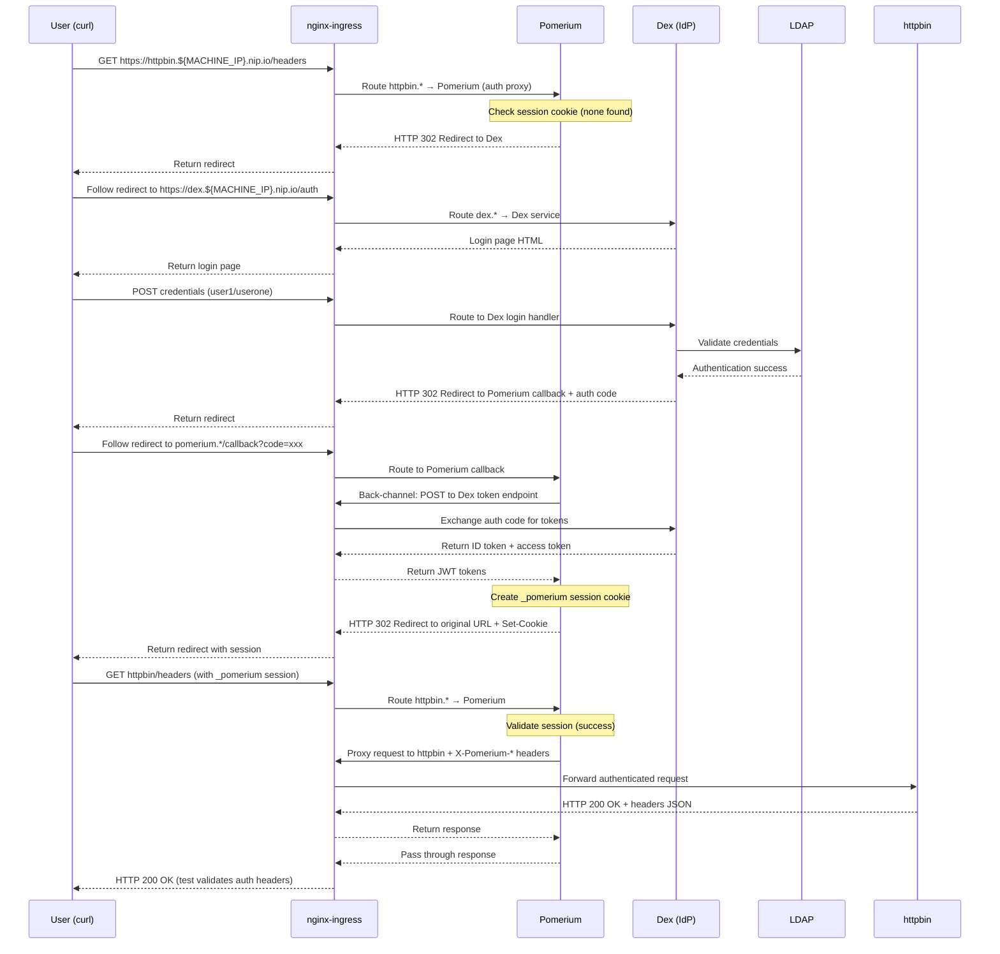

# E2E Tests

E2E tests for OIDC authentication flow using Pomerium, Dex, and LDAP.
Tests component deployments and complete authentication flow with BATS.

## What We Test

### Component Readiness (via BATS)
- All deployments are ready (cert-manager, nginx-ingress, ldap, dex, pomerium, httpbin, gangplank)
- HTTP endpoints are accessible
- Ingresses are properly configured

### Architecture Overview
- **nginx-ingress**: Single entry point (NodePort 31443), routes traffic based on hostname
- **Pomerium**: Authentication proxy with dual role - auth gatekeeper + reverse proxy
- **Traffic Flow**: All requests follow User → nginx-ingress → appropriate service
- **Routing Logic**: nginx-ingress routes httpbin.* requests to Pomerium first for authentication

### Detailed Authentication Flow

The E2E test validates a complete OIDC authentication sequence through the entire stack:

1. **Initial Request**: User accesses `https://httpbin.${MACHINE_IP}.nip.io/headers`
2. **nginx Routes to Pomerium**: nginx-ingress routes httpbin.* requests to Pomerium (auth proxy)
3. **Pomerium Auth Check**: Pomerium checks for `_pomerium` session cookie (none found)
4. **Redirect to Dex**: Pomerium responds with HTTP 302 redirect to `https://dex.${MACHINE_IP}.nip.io/auth`
5. **Dex Authentication**: User submits LDAP credentials (user1/userone) → nginx → Dex → LDAP validation
6. **Auth Code Return**: Dex redirects to Pomerium callback with authorization code
7. **Token Exchange**: Pomerium exchanges auth code for JWT tokens (back-channel request to Dex)
8. **Session Creation**: Pomerium creates `_pomerium` session cookie, redirects to original httpbin URL
9. **Authenticated Access**: nginx → Pomerium (validates session) → proxies request to httpbin with `X-Pomerium-*` headers



### Component Roles
- **nginx-ingress**: Traffic orchestrator, TLS termination, hostname-based routing to services
- **Pomerium**: Authentication decision point AND reverse proxy (dual function)
- **Dex**: OIDC provider, JWT token issuer, integrates with LDAP for user validation
- **LDAP**: User credential store (test user: user1/userone)
- **httpbin**: Protected test application that receives authenticated requests

## TLS Certificate Architecture

### Certificate Generation
- **cert-manager** with self-signed ClusterIssuer generates a common CA certificate
- All services get certificates from the same CA (dex-tls, pomerium-tls, httpbin-tls)
- **CA Trust**: Services that need to communicate mount the CA certificate:
  - Pomerium mounts CA cert at `/certs/ca.crt` to validate Dex's certificate
  - Enables secure service-to-service communication within the cluster
- Tests use `curl -k` to accept self-signed certificates

## Networking

### Ingresses & DNS
- **nginx-ingress** is the single entry point on NodePort 31443
- All services (pomerium, dex, httpbin) accessible via different hostnames through same nginx
- Dynamic DNS using `${MACHINE_IP}.nip.io` (no /etc/hosts needed)
- URLs templated with envsubst before deployment

### Local vs CI Networking
- **Local (Docker Desktop)**: Port mapping `host:${UNIQUE_PORT} → container:31443`
  - Access via `https://*.${MACHINE_IP}.nip.io:${UNIQUE_PORT}`
- **CI (Kind on Linux)**: Direct node access, no port mapping
  - Access via `https://*.${NODE_IP}.nip.io:31443`
  - Avoids hairpinning issues and parallel execution conflicts

## Kustomize Customizations
The `manifests/` folder overlays the base katalog resources:
- **configMapGenerator**: Test-specific configs (Dex LDAP, Pomerium policies)
- **secretGenerator**: Test credentials and keys
- **Patches**: CA cert mounting for service communication, ingress class overrides
- **Templates**: All `.template` files processed with machine IP/port values

## Running Tests
```bash
# Full workflow (create cluster → test → cleanup)
mise run e2e

# Just run tests on existing cluster
mise run e2e-run-tests

# Individual steps
mise run e2e-create-cluster
mise run e2e-cleanup-cluster
```